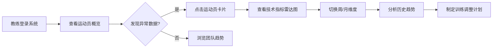

## 1. 产品概述
本产品是面向市体校田径队教练的跳高运动员训练数据仪表盘，帮助教练实时监控20多名运动员的训练状态，快速发现技术问题并制定针对性训练计划。

- 核心目标：将复杂的训练数据转化为直观的可视化图表，提升教练工作效率
- 目标用户：田径队跳高项目教练、助理教练
- 核心价值：数据驱动训练决策，提升运动员成绩表现

## 2. 核心功能

### 2.1 用户角色
| 角色 | 注册方式 | 核心权限 |
|------|----------|----------|
| 教练 | 无需注册（内部系统） | 查看所有运动员数据、切换时间维度、筛选指标 |

### 2.2 功能模块
1. **总览仪表盘**：运动员概览卡片、核心指标汇总、异常预警
2. **运动员详情**：单人多维度数据分析、技术指标趋势图
3. **团队对比**：运动员横向对比雷达图、排名柱状图
4. **时间维度切换**：周/月数据切换、自定义日期范围

### 2.3 页面详情
| 页面名称 | 模块名称 | 功能描述 |
|---------|---------|----------|
| 主仪表盘 | 顶部导航栏 | 时间维度切换器（周/月）、指标筛选、数据刷新按钮 |
| 主仪表盘 | 概览统计区 | 运动员总数、今日训练人次、平均成绩、最佳成绩卡片 |
| 主仪表盘 | 运动员网格 | 20+运动员卡片，展示头像、姓名、最新成绩、状态标签 |
| 主仪表盘 | 趋势图表区 | 团队平均助跑速度、起跳角度、过杆高度趋势折线图 |
| 运动员详情侧边栏 | 基础信息 | 运动员照片、年龄、身高、体重、训练年限 |
| 运动员详情侧边栏 | 技术指标雷达图 | 助跑速度、起跳角度、过杆高度、落地稳定性、节奏评分 |
| 运动员详情侧边栏 | 历史趋势 | 选中指标的周/月趋势折线图 |
| 团队对比视图 | 雷达对比图 | 最多3名运动员技术指标对比 |
| 团队对比视图 | 排名柱状图 | 按指定指标排序的运动员排名 |

## 3. 核心流程

教练打开仪表盘 → 查看运动员概览卡片 → 发现异常数据（红色预警标签）→ 点击运动员卡片查看详情 → 分析技术指标雷达图和趋势 → 切换周/月维度对比 → 制定训练调整计划

## 4. 用户界面设计

### 4.1 设计风格
- **主色调**：深邃藏蓝 `#0F172A`（专业、沉稳），辅以活力橙 `#F97316`（运动、警示）、竞速绿 `#10B981`（优秀、健康）
- **辅助色**：金属灰 `#475569`、亮黄 `#FBBF24`（警告）、警戒红 `#EF4444`（异常）
- **字体**：主标题使用 `Chakra Petch`（运动感等宽字体），正文使用 `Inter`（清晰易读）
- **卡片风格**：深色半透明玻璃态卡片，细微边框，悬停时轻微上浮+发光效果
- **数据可视化**：图表线条圆润，渐变填充，数据更新时有平滑过渡动画
- **空间布局**：非对称网格布局，左侧运动员列表（30%），右侧详情图表区（70%），数据卡片错落排布，营造专业运动数据分析氛围

### 4.2 页面设计概览
| 页面名称 | 模块名称 | UI元素 |
|---------|---------|--------|
| 主仪表盘 | 顶部导航栏 | 深色背景、橙色高亮切换按钮、白色图标、脉冲动画的实时指示灯 |
| 主仪表盘 | 统计卡片 | 玻璃态效果、大数字显示、趋势箭头（绿↑/红↓）、微动画计数 |
| 主仪表盘 | 运动员卡片网格 | 4列网格、卡片悬停上浮、状态标签颜色编码、圆形头像 |
| 主仪表盘 | 趋势图表区 | Recharts折线图、渐变区域填充、数据点呼吸灯效果、平滑过渡动画 |
| 运动员详情 | 雷达图 | 多边形填充、边缘发光、数值标签动态更新 |
| 运动员详情 | 趋势图 | 多色折线、图例交互高亮、区域填充渐变 |

### 4.3 响应式
- 桌面端（1280px+）：4列运动员卡片网格，左侧列表+右侧详情的双栏布局
- 平板端（768-1279px）：2列卡片网格，上下布局
- 移动端（<768px）：单列卡片，图表自适应缩放，触控优化

### 4.4 动画效果
- 页面加载：卡片错落淡入（staggered animation），图表从0开始绘制动画
- 数据更新：数字滚动计数动画，图表路径平滑过渡（ease-in-out 600ms）
- 交互反馈：悬停时卡片轻微上浮+阴影增强，按钮点击缩放效果
- 状态指示：异常数据脉冲闪烁，实时数据呼吸灯效果
