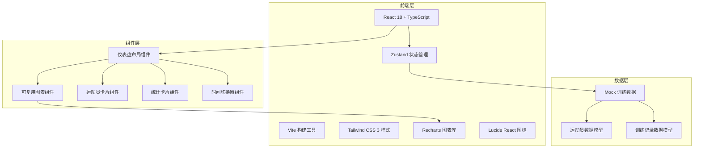
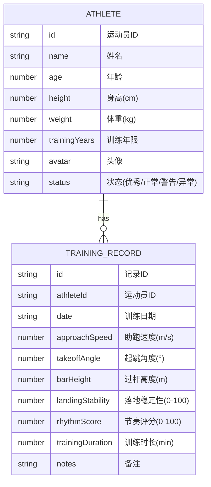

## 1. 架构设计



## 2. 技术描述

- **前端框架**：React@18 + TypeScript@5 + Vite@5
- **样式方案**：Tailwind CSS@3.4
- **状态管理**：Zustand@4
- **图表库**：Recharts@2.12
- **图标库**：Lucide React@0.395
- **初始化工具**：vite-init
- **后端**：无（纯前端，使用Mock数据）
- **数据来源**：本地Mock数据，模拟20+运动员30天训练记录

## 3. 路由定义

| 路由 | 用途 |
|------|------|
| / | 主仪表盘页面，包含所有功能模块 |

## 4. 数据模型

### 4.1 数据模型定义



### 4.2 TypeScript 类型定义

```typescript
interface Athlete {
  id: string;
  name: string;
  age: number;
  height: number;
  weight: number;
  trainingYears: number;
  avatar: string;
  status: 'excellent' | 'normal' | 'warning' | 'abnormal';
}

interface TrainingRecord {
  id: string;
  athleteId: string;
  date: string;
  approachSpeed: number;
  takeoffAngle: number;
  barHeight: number;
  landingStability: number;
  rhythmScore: number;
  trainingDuration: number;
  notes?: string;
}

interface TimeRange {
  type: 'week' | 'month';
  startDate: string;
  endDate: string;
}

interface MetricOption {
  key: keyof TrainingRecord;
  label: string;
  unit: string;
  color: string;
  min: number;
  max: number;
}
```

## 5. 项目结构

```
d:\bz\615\6151/
├── src/
│   ├── components/          # 可复用组件
│   │   ├── charts/          # 图表组件
│   │   │   ├── LineChart.tsx
│   │   │   ├── RadarChart.tsx
│   │   │   ├── BarChart.tsx
│   │   │   └── AreaChart.tsx
│   │   ├── AthleteCard.tsx  # 运动员卡片
│   │   ├── StatCard.tsx     # 统计卡片
│   │   ├── TimeRangePicker.tsx  # 时间选择器
│   │   └── MetricFilter.tsx # 指标筛选器
│   ├── data/                # Mock数据
│   │   ├── athletes.ts
│   │   ├── trainingRecords.ts
│   │   └── metrics.ts
│   ├── hooks/               # 自定义Hooks
│   │   ├── useAnimatedNumber.ts
│   │   ├── useTimeRangeData.ts
│   │   └── useAthleteStats.ts
│   ├── store/               # 状态管理
│   │   └── useDashboardStore.ts
│   ├── types/               # 类型定义
│   │   └── index.ts
│   ├── utils/               # 工具函数
│   │   ├── dataUtils.ts
│   │   └── animationUtils.ts
│   ├── App.tsx              # 主应用组件
│   ├── main.tsx             # 入口文件
│   └── index.css            # 全局样式
├── .trae/
│   └── documents/
│       ├── PRD.md
│       └── 技术架构.md
├── package.json
├── tsconfig.json
├── vite.config.ts
├── tailwind.config.js
└── postcss.config.js
```

## 6. 核心技术实现要点

1. **组件复用设计**：所有图表组件接受通用props（data、dataKey、colors、animationDuration），支持多种数据格式
2. **平滑过渡动画**：使用Recharts的`isAnimationActive`和`animationDuration`属性，配合自定义数字滚动Hook
3. **时间维度切换**：使用Zustand管理全局时间范围状态，所有组件响应式更新
4. **数据聚合**：自定义Hook `useTimeRangeData` 按周/月聚合训练数据，计算平均值、最大值、趋势
5. **状态预警**：基于阈值判断运动员状态（优秀/正常/警告/异常），使用不同颜色标识
6. **性能优化**：使用React.memo包裹图表组件，避免不必要的重渲染
